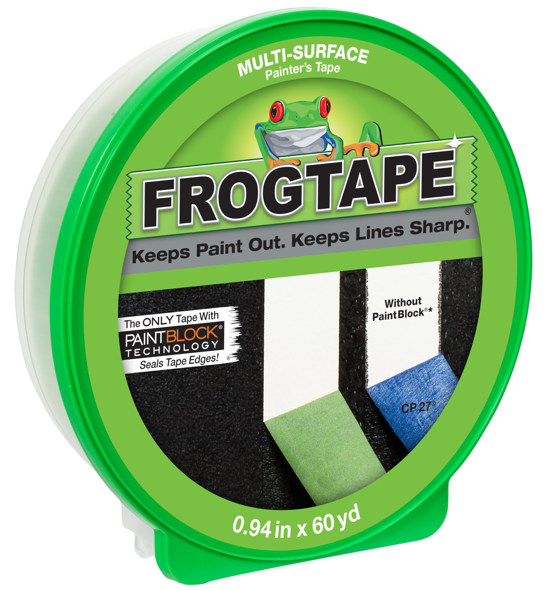
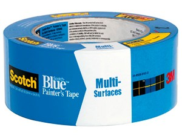
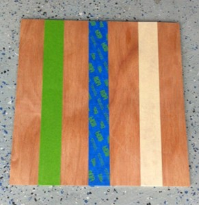
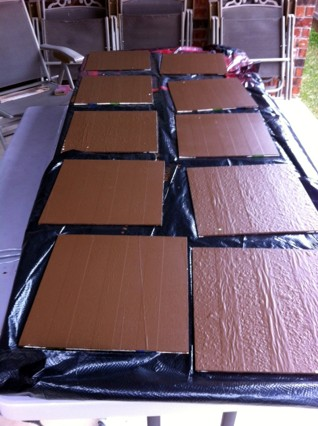
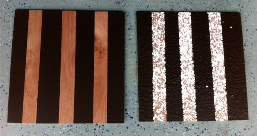

# Unmasking the Mystery of Masking Tape
This the the analysis that started it all! Back in 9th grade, I collected this data for a school science fair, little did I know back then, I would eventually get a masters in statistics. I recently found this dataset among my old files and I decided to upgrade the analysis a little bit😉.

The main goal of this analysis is to understand and investigate the claims of the more expensive name brand: Frog tape which claims to have a "paint block" technology but is twice the price. To determine whether or not Frog tape is worth the hype and the price, I compared it against 2 popular alternatives, namely the blue 3M painters tape, and the tan standard masking tape.

 

## The Experiment Design
### Factors and Treatments
There were two main factors in this experiment:
1. Tape: Frog/3M/Standard
2. Surface: Textured/Flat

These two factors led to six unique treatment combinations (Frog/Textured, Frog/Flat, 3M/Textured, etc.)

### Blocking and Randomization
For the experiment I used 20 different 30 cm x 30 cm flat wooden boards. Half of them were sprayed with wall texture, and the other half were left as is. I put 3 strips of tape (one for each brand) each spaced exactly 5 cm apart in a random order on each board. I then used a paint roller to put two layers of dark brown Clark & Kensington interior latex paint on each of the 20 boards.

### Procedure and Controls
After the first layer of paint was applied, I waited exactly 2 hours (as recomended by the paint manufacturer) before applying a second coat. The second coat was then left to dry for 24 hours before attempting to remove the masking tape. For each tape strip, I removed the tape maintaining a 180 degree angle to ensure consistency. 

### Response Variable
For each board and paint strip, I counted and recorded the number of times that paint seeped underneath the tape and on the board beneath and ranked the severity of the seepages on a scale of 1-10.

